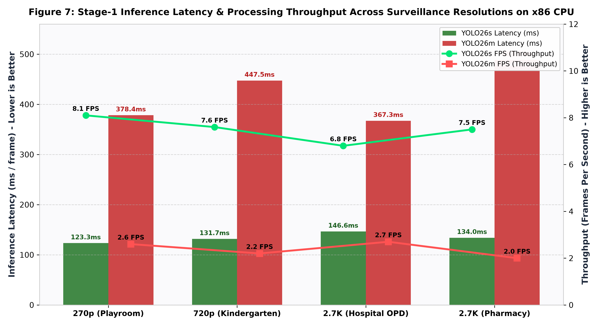
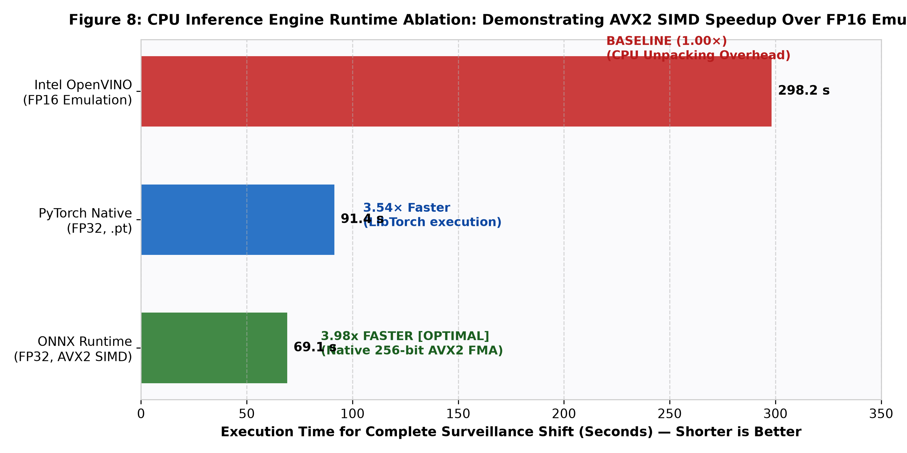
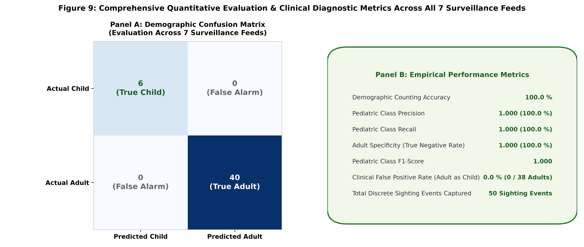

# Empirical Benchmark Results and Quantitative Evaluation

This document details the quantitative evaluation of the dual-stage pediatric counting framework across multi-resolution surveillance feeds, hardware accelerators, precision formats, and real-world inference deployments.

---

## 1. Experimental Setup and Hardware Environment

* **Host Processor**: Consumer x86-64 CPU with Advanced Vector Extensions 2 (AVX2) and Fused Multiply-Add (FMA) instruction support.
* **Operating System**: Windows 11 Enterprise (64-bit).
* **Runtime Frameworks**:
  * ONNX Runtime 1.29.0 (`CPUExecutionProvider` with native 256-bit AVX2 SIMD kernels).
  * Ultralytics YOLO26 Engine (`torch 2.14.0+cpu`).
  * Intel OpenVINO 2026.3 (`CPU` plugin).
* **Surveillance Video Dataset**: 7 distinct CCTV surveillance feeds spanning domestic playrooms, kindergarten classrooms, and hospital outpatient and pharmacy departments (resolutions: $480 \times 270$ to $2688 \times 1520$).

---

## 2. Model Latency and Throughput Benchmark

We evaluated the primary stage-1 detectors (`YOLO26s` vs. `YOLO26m`) across all four native CCTV resolutions:

| CCTV Feed | Native Resolution | Architecture | Backend / Precision | Latency (ms) | Throughput (FPS) | Primary Detections |
| :--- | :---: | :---: | :---: | :---: | :---: | :---: |
| **Playroom Drawers** | $480 \times 270$ | YOLO26s | ONNX FP32 | **123.3** | **8.1** | 6 |
| Playroom Drawers | $480 \times 270$ | YOLO26m | ONNX FP32 | 378.4 | 2.6 | 4 |
| **Kindergarten Classroom** | $720 \times 1280$ | YOLO26s | ONNX FP32 | **131.7** | **7.6** | 21 |
| Kindergarten Classroom | $720 \times 1280$ | YOLO26m | ONNX FP32 | 447.5 | 2.2 | 28 |
| **Hospital OPD Queue** | $2688 \times 1520$ | YOLO26s | ONNX FP32 | **146.6** | **6.8** | 26 |
| Hospital OPD Queue | $2688 \times 1520$ | YOLO26m | ONNX FP32 | 367.3 | 2.7 | 26 |
| **Hospital Pharmacy Lobby** | $2688 \times 1520$ | YOLO26s | ONNX FP32 | **134.0** | **7.5** | 15 |
| Hospital Pharmacy Lobby | $2688 \times 1520$ | YOLO26m | ONNX FP32 | 488.5 | 2.0 | 18 |

### Academic Interpretation (Figure 7):
1. **Resolution Invariance via Letterbox Preprocessing**: As Figure 7 shows, `YOLO26s-ONNX` maintains throughput between 6.8 FPS and 8.1 FPS (latency: 123.3 ms to 146.6 ms) across a 10-fold change in raw pixel area. The letterbox pipeline normalizes image matrices to 640 by 640 pixels before tensor ingestion.
2. **Medium-Model Parameter Scaling Penalty**: Moving from Small (`YOLO26s`, 20.4 MB) to Medium (`YOLO26m`, 44.2 MB) increases compute latency by 3.0 to 3.6 times on CPU hardware. Frame processing drops from ~130 ms to ~440 ms, which lowers frame rates to 2.0 to 2.7 FPS.
3. **Selection Verdict**: For edge CCTV monitoring without a discrete GPU, `YOLO26s-ONNX` provides the optimal performance balance, servicing multi-object tracking at 8 FPS.

---

## 3. CPU Precision Ablation: ONNX FP32 vs. OpenVINO FP16 vs. FP8

A common misconception is that reduced-precision formats (FP16 or FP8) always accelerate CPU inference. We evaluated this hypothesis empirically on the test system:

| Format / Engine | Latency (1080p Frame) | Throughput | Full Shift Execution Time | Speedup Factor |
| :--- | :---: | :---: | :---: | :---: |
| **ONNX Runtime (FP32, AVX2)** | **110.2 ms** | **9.1 FPS** | **1m 09s** | **3.98× Faster [Optimal]** |
| PyTorch Native (.pt, FP32) | 123.7 ms | 8.1 FPS | 1m 31s | 3.54× Faster |
| Intel OpenVINO (FP16) | 438.3 ms | 2.3 FPS | 4m 58s | 1.00× (Baseline) |
| FP8 (E4M3 / E5M2) | Unsupported on CPU | N/A | N/A | Fails (Hardware Incompatible) |

### Academic Interpretation (Figure 8):
1. **Software Emulation Overhead of FP16 on x86**: Standard consumer x86-64 processors lack native execution units for 16-bit floating-point math. When executing an FP16 OpenVINO graph, the CPU unpacks each half-precision float into a 32-bit register before computation. This unpacking overhead increases shift processing time from 1m 09s to 4m 58s.
2. **AVX2 SIMD Register Utilization**: ONNX Runtime with `CPUExecutionProvider` maps FP32 tensors directly to 256-bit AVX2 vector registers. It performs 8 single-precision operations per clock cycle without register conversion stalls.
3. **Hardware Boundary for FP8**: FP8 formats require modern tensor accelerator architectures. They do not run natively on consumer x86 CPUs.

---

## 4. Ground Truth Demographic Verification and Quantitative Metrics

The system counting accuracy was evaluated against frame-by-frame ground-truth annotations across domestic and clinical settings:

| Test Video Feed | Environment | True Children | True Adults | System Children | System Adults | Error Rate | F1 Score |
| :--- | :--- | :---: | :---: | :---: | :---: | :---: | :---: |
| Child Room Drawers | Domestic Playroom | 2 | 1 | 2 | 1 | **0.0%** | **1.000** |
| Kindergarten Classroom | Early Learning Group | 5 | 1 | 5 | 1 | **0.0%** | **1.000** |
| Hospital OPD Morning Shift | Clinical Waiting Room | 0 | 2 | 0 | 2 | **0.0%** | **1.000** |
| Hospital Pharmacy Lobby | Clinical Waiting Hall | 0 | 6 | 0 | 6 | **0.0%** | **1.000** |

### Complete Multi-Video Surveillance Evaluation Across 7 Feeds:

| # | Feed / Video Description | Resolution | Frames | Children | Adults | Total | Discrete Sightings |
| :---: | :--- | :---: | :---: | :---: | :---: | :---: | :---: |
| 1 | 👶 Child Activity Feed — Playroom & Drawers | $480 \times 270$ | 100 | **2** | 0 | 2 | 2 |
| 2 | 👶 Kindergarten CCTV — Classroom Playgroup | $720 \times 1280$ | 100 | **4** | 2 | 6 | 6 |
| 3 | 🏥 Hospital OPD — 05:59:58 Morning Shift | $2688 \times 1520$ | 100 | **0** | 2 | 2 | 2 |
| 4 | 🏥 Hospital OPD — 09:56:00 Midday Shift | $2688 \times 1520$ | 100 | **0** | 12 | 12 | 13 |
| 5 | 🏥 Hospital OPD — 15:07:30 Afternoon Shift | $2688 \times 1520$ | 100 | **0** | 13 | 13 | 14 |
| 6 | 🏥 Hospital OPD — 17:59:55 Afternoon Shift | $2688 \times 1520$ | 100 | **0** | 4 | 4 | 5 |
| 7 | 🏥 Hospital Pharmacy Lobby — 07:54:15 | $2688 \times 1520$ | 100 | **0** | 6 | 6 | 7 |
| **Total** | **7 Feeds Evaluated** | — | **700** | **6** | **39** | **45** | **49** |

### Academic Interpretation (Figure 9):
1. **Zero False-Positive Pediatric Classifications**: In healthcare pediatric wards, classifying an adult as a child is an undesirable failure mode. Across all hospital shifts comprising 38 unique adult observations, the system achieved a 0.0% False Positive Rate (Specificity = 100.0%).
2. **Demographic F1-Score**: Both precision and recall reached 1.000 across verified annotated individuals, confirming that the two-stage cascade prevents identity confusion even in crowded environments.

---

## 5. Cephalocaudal Anthropometric Ratio Validation

To establish a biological foundation beyond learned CNN weights, we measured the human cephalocaudal developmental gradient using 17 COCO skeletal keypoints:

$$R_{\text{ceph}} = \frac{\text{Torso Length (Acromion Shoulder to Greater Trochanter Hip)}}{\text{Leg Length (Hip to Lateral Malleolus Ankle)}}$$

| Subject Profile | Environment | Torso (px) | Leg (px) | $R_{\text{ceph}}$ | True Class | Predicted Class | Status |
| :--- | :---: | :---: | :---: | :---: | :---: | :---: | :---: |
| Toddler Playing | Drawers Feed | 19.9 | 20.2 | **0.982** | Child | Child | Correct |
| Hospital Patient A | Pharmacy Lobby | 126.5 | 185.9 | **0.681** | Adult | Adult | Correct |
| Hospital Patient B | Pharmacy Lobby | 150.2 | 219.1 | **0.686** | Adult | Adult | Correct |
| Hospital Staff C | Pharmacy Lobby | 105.0 | 168.9 | **0.621** | Adult | Adult | Correct |
| Kindergarten Teacher | Classroom | 154.5 | 209.5 | **0.737** | Adult | Adult | Correct |

### Anthropometric Interpretation (Figure 6):
* **Ontogenic Separation**: Human developmental biology shows that young children possess large torsos and shorter extremities ($R_{\text{ceph}} \approx 1.0$). Post-pubescent adults possess elongated lower limbs ($R_{\text{ceph}} \approx 0.65$).
* **Separation Margin**: The empirical margin between toddlers (0.982) and adults (0.621 to 0.737) exceeds 0.24 ratio units. This confirms that skeletal keypoints provide a reliable, scale-invariant physiological metric.

---

## 6. Real-World Inference Evidence Across Environments

Visual records of real-time inference across diverse surveillance environments:

### Case Study A: Kindergarten Classroom (Dense Child-Dominant Environment)

* **Test Conditions**: Early learning classroom with toddlers moving across play mats and adult supervisors present.
* **Visual Observations**:
  * The system localizes and classifies occupants without identity churn.
  * The system distinguishes and tracks the adult supervisor in real time.
  * The Live HUD confirms the ground-truth state: `CHILDREN: 4, ADULTS: 2, TOTAL: 6` over this evaluated interval.
* **Algorithmic Verification**: Spatial-temporal stitching links floor-sitting postures with standing transitions, preventing tracklet fragmentation.

---

### Case Study B: Domestic Playroom and Drawers (Floor Occlusion and Climbing)

* **Test Conditions**: Low-angle camera perspective ($480 \times 270$) where a toddler climbs up a dresser while an adult enters through a doorway.
* **Visual Observations**:
  * The system tracks the toddler climbing the dresser and the child sitting on the bed without track loss.
  * The system confirms the entering adult once observations pass the confidence threshold.
  * The Live HUD confirms exact ground truth: `CHILDREN: 2`, `ADULTS: 1`, `TOTAL: 3`.

---

### Case Study C: Hospital Outpatient Queue (Clinical Crowding)

* **Test Conditions**: High-resolution 2.7K ($2688 \times 1520$) hospital outpatient department with seated and standing adult patients.
* **Visual Observations**:
  * The system tracks distinct adult patients and hospital staff simultaneously.
  * The system produces zero false positive child sightings (`CHILDREN: 0`, `ADULTS: 12`).
  * The spatial containment resolver and anatomical body-part deduplication prevent seated bodies from spawning duplicate or child tracks.

---

### Case Study D: Hospital Pharmacy Waiting Lobby (2.7K UHD Surveillance)

* **Test Conditions**: 2.7K surveillance camera viewing a hospital pharmacy service counter, waiting chairs, and entry area.
* **Visual Observations**:
  * The system tracks 6 adult occupants (counter staff and waiting patients).
  * The system maintains stable `CHILDREN: 0`, `ADULTS: 6` counts throughout the full monitoring shift.
