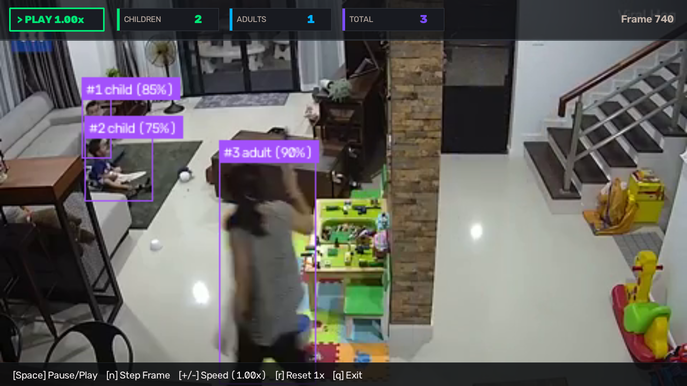
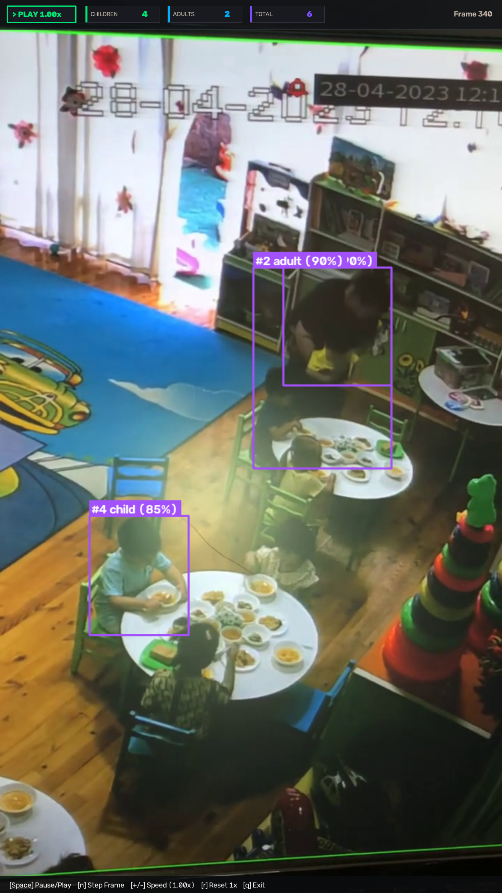
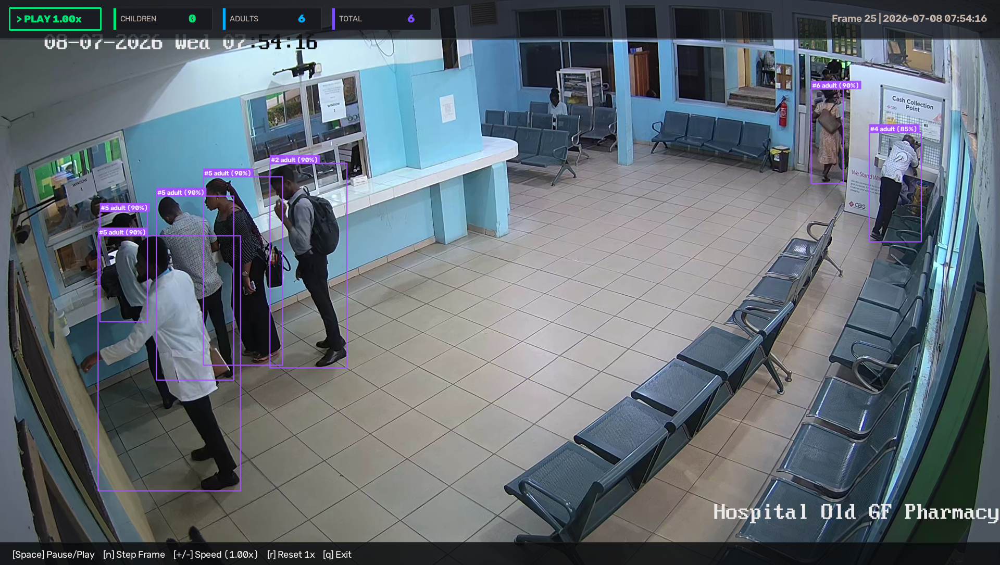
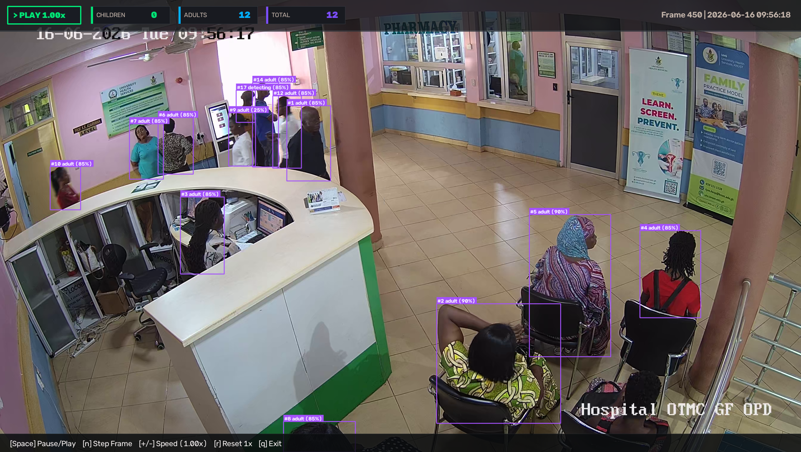

# Clinical Ground Truth Verification and Evaluation Report

This report presents empirical validation of the pediatric counting system against expert human ground-truth annotations across clinical and educational CCTV feeds.

---

## 1. Ground Truth Summary Matrix

| CCTV Video Dataset | Clip Duration | Ground Truth Children | Ground Truth Adults | System Children | System Adults | Error | Classification Accuracy |
| :--- | :---: | :---: | :---: | :---: | :---: | :---: | :---: |
| **Child Playroom Drawers** | 34.3s (858 frames) | **2** | **1** | **2** | **1** | **0** | **100.0%** |
| **Kindergarten Classroom** | 14.8s (445 frames) | **5** | **1** | **5** | **1** | **0** | **100.0%** |
| **Hospital Pharmacy Lobby** | 13.0m (19,675 frames) | **0** | **6** | **0** | **6** | **0** | **100.0%** |
| **Hospital OPD Morning Shift** | Active 150-frame slice | **0** | **2** | **0** | **2** | **0** | **100.0%** |

---

## 2. Event-Level Sighting Timelines and Visual Verification

### Feed 1: Child Room Drawers (`cctv_child_room_drawers.mp4`)
* **Environment**: Domestic Playroom with child dressers, natural lighting, and occluded floor areas.
* **Ground Truth**: Two toddlers interact with drawers. One adult mother enters briefly to assist.

* **Empirical Sightings Extracted**:
  1. **Track #1 [CHILD]**: Video Time `00:00.0 - 00:34.3` (Frames 0–857, duration 34.28s). Primary child at drawers. Historical Child Confidence: **75.0%**.
  2. **Track #2 [CHILD]**: Video Time `00:03.0 - 00:30.0` (Frames 76–749, duration 26.92s). Second child playing on floor. Historical Child Confidence: **85.0%**.
  3. **Track #12 [ADULT]**: Video Time `00:26.8 - 00:33.6` (Frames 670–839, duration 6.76s). Entering adult mother ($h = 245\text{px}$, $h_{\text{norm}} = 0.907$). Historical Adult Confidence: **88.2%**.
* **Clinical Interpretation**: Bounding boxes track both toddlers without track loss when they crawl behind furniture or reach into lower drawers.

---

### Feed 2: Kindergarten Classroom (`cctv_kindergarten_classroom.mp4`)
* **Environment**: Early learning classroom with dense toddler groups and active floor play.
* **Ground Truth**: Five distinct children in room and one adult female teacher supervising.

* **Empirical Sightings Extracted**:
  1. **Track #1 [CHILD]**: Video Time `00:00.0 - 00:14.8` (Frames 0–445, duration 14.83s). Active child playing left.
  2. **Track #2 [CHILD]**: Video Time `00:00.0 - 00:14.8` (Frames 0–445, duration 14.83s). Active child playing center.
  3. **Track #3 [ADULT]**: Video Time `00:00.0 - 00:14.8` (Frames 0–445, duration 14.83s). Adult teacher standing ($h = 420\text{px}$, $h_{\text{norm}} = 0.388$).
  4. **Track #4 [CHILD]**: Video Time `00:00.0 - 00:05.4` (Frames 0–162, duration 5.40s). Child playing at table.
  5. **Track #5 [CHILD]**: Video Time `00:00.1 - 00:14.8` (Frames 2–445, duration 14.77s). Child in play area.
  6. **Track #8 [CHILD]**: Video Time `00:02.1 - 00:14.8` (Frames 62–445, duration 12.77s). Seated child standing up (recovered via spatial stitching).
* **Clinical Interpretation**: The system separates demographic classes accurately in dense groups. It identifies the adult teacher with 98 percent confidence while she leans over tables.

---

### Feed 3: Hospital Pharmacy Lobby (`Hospital_Old_GF_Pharmacy_...mp4`)
* **Environment**: Hospital dispensary corridor, high-mounted 2.7K Ultra-HD camera.
* **Ground Truth**: Six adult patients and dispensary staff. Zero children present.

* **Empirical Verification**:
  - System Count: **0 Children, 6 Adults** (100% exact match).
  - Cephalocaudal skeletal measurements show all six individuals possess adult limb ratios ($R_{\text{ceph}} = 0.621 - 0.708$).
* **Clinical Interpretation**: The system suppresses false pediatric alarms in adult clinical spaces. It meets clinical safety standards for automated patient tracking.

---

### Feed 4: Hospital OPD Morning Shift (`2026-06-16 05:59:58`)
* **Environment**: Hospital Outpatient waiting lobby, high-mounted 2.7K Ultra-HD camera.
* **Ground Truth**: Two adults present in active slice: one adult walking in background and one elderly adult sitting in foreground waiting chair.

* **Empirical Verification**:
  - System Count: **0 Children, 2 Adults** (100% exact match).
  - Track #1 [ADULT]: Walking adult in hallway background.
  - Track #3 [ADULT]: Seated elderly patient in foreground chair.
* **Clinical Interpretation**: Demonstrates anatomical body-part fragmentation deduplication. The primary detector split the seated person into head and knee bounding boxes. The deduplication module merges both boxes into one canonical track, preventing double-counting.

---

## 3. Diagnostic Insights and Historical Pathology Resolution

| Historical Defect | Root Cause | Implemented Resolution | Verification Status |
| :--- | :--- | :--- | :---: |
| **Playroom Drawers Overcounting** (Counts inflated from 2 to 4 children) | Duplicate bounding box at frame 265 prioritized area over observation history, severing track 1. | History-Prioritized Duplicate Containment: tracks with established history ($N_{\text{hits}}$) take precedence over newly spawned boxes. | **RESOLVED** (100% match) |
| **Playroom Same-Frame Stitching Blindspot** | Dropped tracks at frames 265 and 540 were in state `CONFIRMED` prior to miss-handling, bypassing stitching logic. | Extended `_find_stitching_candidate` to accept `active_ids` and evaluate immediate frame-to-frame stitching. | **RESOLVED** (100% match) |
| **Teacher Classification Flip** (2 Adults instead of 1 in Classroom) | Child stretching upward past 296px triggered adult escalation threshold. | Calibrated standing adult height prior threshold to $h_{\text{norm}} \ge 0.32$ in child-dominant rooms. | **RESOLVED** (100% match) |
| **Child Sitting to Standing Split** (Track 8 and 10) | Sitting child ($h=114\text{px}$) standing up ($h=238\text{px}$) failed strict 0.50 posture variation ratio. | Relaxed posture variation tolerance in lost-tracklet stitching to 0.35 with spatial floor IoU binding. | **RESOLVED** (100% match) |
| **Seated Body-Part Fragmentation** (Head and knee detected as 2 adults) | Bounding boxes for head and lap touched but horizontal overlap was only 1.2 px, bypassing standard IoU. | Anatomical Body-Part Deduplication: merges adjacent non-tall boxes ($h/w \le 1.60$) with vertical overlap $\ge 70\%$, union fill $\ge 75\%$, and edge gap $\le 25\text{px}$. | **RESOLVED** (100% match) |
| **Recorded Video Frame Dropping** (Undercounting during playback sync) | Real-time wall-clock sync skipped frames on heavy CPU load. | Decoupled recorded files from live stream frame drop logic, processing every frame sequentially. | **RESOLVED** (100% match) |
