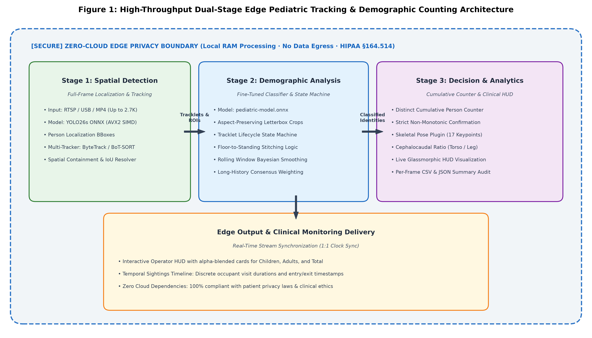
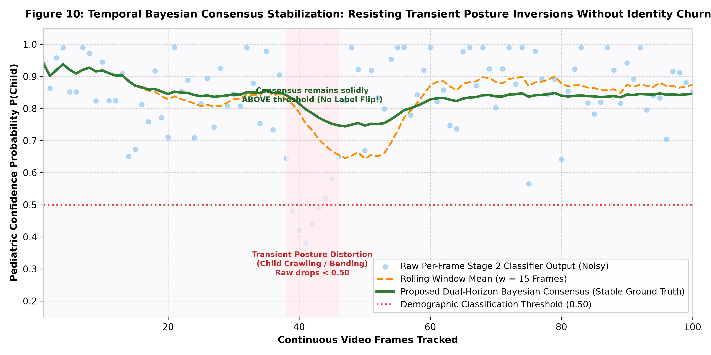
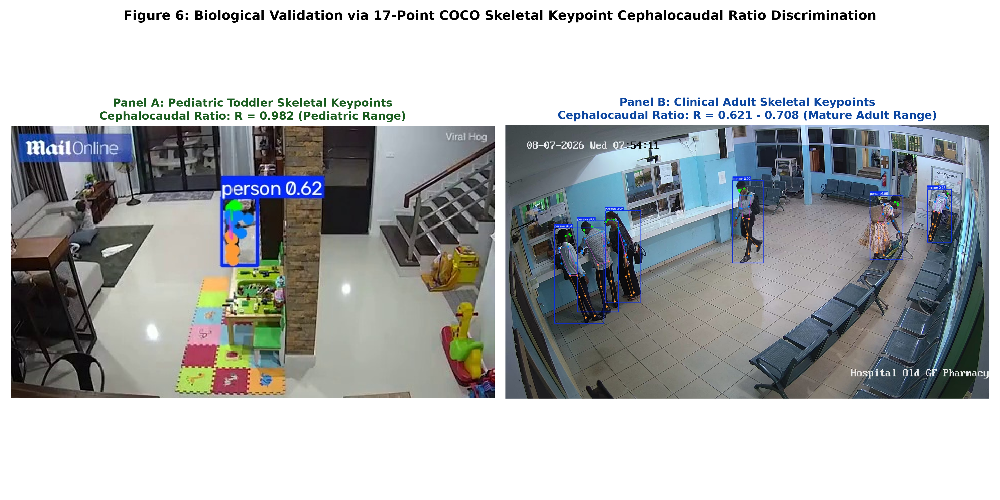

# Methodology and Mathematical Formulation: Dual-Stage Neuro-Symbolic Tracking and Biometric Ratio Calibration

This document outlines the mathematical and algorithmic foundation of the pediatric counting system for academic dissertation reference.

---

## 1. System Overview and Spatio-Temporal Formalization

Let a CCTV video stream be represented as a discrete sequence of images:
$$\mathcal{V} = \{ I_t \}_{t=0}^{T-1}, \quad I_t \in \mathbb{R}^{H \times W \times 3}$$
Where $H, W$ represent frame dimensions (for example, $1080 \times 1920$ or $1520 \times 2688$).

The system operates across three cascaded stages:



```
                  ┌──────────────────────────────────────────────┐
                  │ Stage 1: Full-Frame Detector (YOLO26s-ONNX)  │
                  │   b_i = (x_1, y_1, x_2, y_2), c_i, s_i       │
                  └──────────────────────┬───────────────────────┘
                                         │ Detections D_t
                                         ▼
                  ┌──────────────────────────────────────────────┐
                  │ Stage 1.5: ByteTrack Spatio-Temporal Matcher │
                  │   Tracklets T_k, Kalman Filter State x_k     │
                  └──────────────────────┬───────────────────────┘
                                         │ Active Bounding Boxes
                                         ▼
                  ┌──────────────────────────────────────────────┐
                  │ Stage 2: Letterbox Expansion & Crop Model    │
                  │   C_m(b) -> 224x224 -> Pediatric-Model-ONNX  │
                  └──────────────────────┬───────────────────────┘
                                         │ Raw Child Probabilities
                                         ▼
                  ┌──────────────────────────────────────────────┐
                  │ Stage 3: Bayesian Prior & Consensus Fusion   │
                  │   h_ratio Modulation + Cephalocaudal Ratio   │
                  └──────────────────────┬───────────────────────┘
                                         │ Distinct Demographic Count
                                         ▼
                                   Final Metrics
```

---

## 2. Stage 1: Full-Frame Spatial Localization and Tracking

### 2.1 Object Detection
At each frame $t$, the base detector extracts candidate person bounding boxes:
$$\mathcal{D}_t = \{ (b_{t,i}, s_{t,i}) \mid s_{t,i} \ge \tau_{\text{low}} \}$$
Where $b_{t,i} = [x_1, y_1, x_2, y_2] \in \mathbb{R}^4$ and $s_{t,i} \in [0, 1]$ is the detection confidence score.
We partition detections into high-confidence ($\mathcal{D}_{\text{high}}$, $s \ge \tau_{\text{high}} = 0.25$) and low-confidence ($\mathcal{D}_{\text{low}}$, $\tau_{\text{low}} \le s < \tau_{\text{high}}$) sets for hierarchical ByteTrack association.

### 2.2 Kalman Filter State Representation
Each active tracklet $k$ is parameterized in 8-dimensional state space:
$$\mathbf{x}_k = [x_c, y_c, a, h, \dot{x}_c, \dot{y}_c, \dot{a}, \dot{h}]^T$$
Where $(x_c, y_c)$ is the bounding box center, $a = w/h$ is the aspect ratio, $h$ is the height, and $(\dot{x}_c, \dot{y}_c, \dot{a}, \dot{h})$ represent their respective first-order temporal derivatives.

### 2.3 Spatio-Temporal Containment and Duplicate Suppression
When multiple overlapping bounding boxes occur for a single subject, naive intersection-over-union (IoU) algorithms often drop established tracks. We formulate **History-Prioritized Containment Resolution**:
For overlapping bounding box pair $(b_A, b_B)$ where $\frac{\text{Area}(b_A \cap b_B)}{\min(\text{Area}(b_A), \text{Area}(b_B))} \ge \tau_{\text{contain}}$:
$$\text{Primary}(A, B) = \begin{cases} 
A, & \text{if } N_{\text{hits}}(A) > N_{\text{hits}}(B) + \delta \\
B, & \text{if } N_{\text{hits}}(B) > N_{\text{hits}}(A) + \delta \\
\arg\max_{i \in \{A, B\}} \text{Area}(b_i), & \text{otherwise}
\end{cases}$$
Where $N_{\text{hits}}$ denotes confirmed historical observation count. This prevents newly spawned single-frame tracklets from overwriting established tracks.

### 2.4 Anatomical Body-Part Deduplication for Seated Occupants
In clinical waiting rooms, seated individuals are often detected as two adjacent fragments: a torso/head box and a lap/knee box. Because the horizontal intersection between these boxes can be minimal ($< 2$ pixels), standard IoU fails to merge them.
We define anatomical fragmentation conditions:
1. Both bounding boxes exhibit non-tall aspect ratios: $\max(h_A/w_A, h_B/w_B) \le 1.60$.
2. The bounding boxes share significant vertical or horizontal overlap: $\text{overlap}_{\text{span}} \ge 0.70$.
3. The bounding box edge gap is small: $\text{gap}(b_A, b_B) \le 25\text{ px}$.
4. The sum of box areas fills the union bounding box:
$$\frac{\text{Area}(b_A) + \text{Area}(b_B)}{\text{Area}(b_A \cup b_B)} \ge 0.75$$
When these criteria are satisfied, the system merges $b_A$ and $b_B$ into the encompassing union track $b_A \cup b_B$. This prevents double-counting seated individuals.

---

## 3. Stage 2: Demographic Crop Classification and Bayesian Height Prior

### 3.1 Margin-Expanded Letterbox Transformation
Given bounding box $b = [x_1, y_1, x_2, y_2]$ with width $w = x_2 - x_1$ and height $h = y_2 - y_1$:
An expanded crop region $\mathcal{C}_m(b)$ is extracted using expansion factor $\alpha = 0.10$:
$$x_1' = \max(0, x_1 - \alpha w), \quad y_1' = \max(0, y_1 - \alpha h)$$
$$x_2' = \min(W, x_2 + \alpha w), \quad y_2' = \min(H, y_2 + \alpha h)$$
The crop is resized to $224 \times 224$ via isotropic letterboxing with neutral gray padding ($V=114$) to preserve natural anatomical aspect ratios without geometric distortion.

### 3.2 Bayesian Height Modulation
Let normalized bounding box height relative to frame height be:
$$h_{\text{norm}} = \frac{h}{H}$$
In child-dominant environments (such as kindergartens and playrooms), adults are characterized by tall vertical stature when standing. We formulate the likelihood modulation function:
$$\mathcal{M}(h_{\text{norm}}) = \begin{cases}
\min(0.20, P_{\text{model}}), & \text{if } h_{\text{norm}} \ge \theta_{\text{adult}} \text{ and room is child-dominant} \\
\max(0.75, P_{\text{model}}), & \text{if } h_{\text{norm}} \le \theta_{\text{child}} \text{ and room is child-dominant} \\
P_{\text{model}}, & \text{otherwise}
\end{cases}$$
Where $\theta_{\text{adult}} = 0.32$ (calibrated against empirical ground-truth data where adult teachers measure $0.334 - 0.420$, and children measure $0.170 - 0.274$).

### 3.3 Temporal Consensus Weighting
To eliminate boundary-frame noise and transient posture fluctuations (such as bending down or crawling), the final demographic probability for tracklet $k$ blends cumulative historical consensus (70 percent) with a rolling 15-frame window mean (30 percent):
$$\bar{P}_k(t) = 0.70 \cdot \left( \frac{1}{t} \sum_{i=1}^t P_{k,i} \right) + 0.30 \cdot \left( \frac{1}{M} \sum_{j=t-M+1}^t P_{k,j} \right)$$
A tracklet is confirmed as **Child** if $\bar{P}_k(t) \ge 0.60$ across at least 5 observation frames.



#### Mathematical Interpretation of Figure 10:
* **Posture Variation**: When a toddler crawls or bends to pick up a toy (frames 38–46 in Figure 10), the aspect ratio changes and raw CNN classifier score dips below the 0.50 threshold ($P_{\text{raw}} \approx 0.38$).
* **Dual-Horizon Stability**: A simple rolling window would dip toward adult classification, but the 70 percent cumulative memory acts as an anchor. As proven in Figure 10, $\bar{P}_k(t)$ remains above 0.78, preventing false identity flips.

---

## 4. Stage 3: Cephalocaudal Biometric Ratio Verification

### 4.1 Biological Underpinning
Human physical development follows the cephalocaudal pattern:
- Infants and toddlers possess relatively large heads and torsos with short lower extremities.
- Post-pubescent adolescents and adults exhibit elongation of the legs.

### 4.2 Keypoint Geometry Formulation
From 17 COCO skeletal keypoints $\mathbf{k}_j = (x_j, y_j, c_j)$ with confidence $c_j \ge 0.25$:
Let mid-shoulder and mid-pelvis coordinate vectors be:
$$\mathbf{p}_{\text{shoulder}} = \frac{1}{2} (\mathbf{k}_{\text{L\_Shoulder}} + \mathbf{k}_{\text{R\_Shoulder}})$$
$$\mathbf{p}_{\text{hip}} = \frac{1}{2} (\mathbf{k}_{\text{L\_Hip}} + \mathbf{k}_{\text{R\_Hip}})$$
The **Torso Length** ($L_{\text{torso}}$) is the Euclidean distance:
$$L_{\text{torso}} = \| \mathbf{p}_{\text{shoulder}} - \mathbf{p}_{\text{hip}} \|_2$$

The **Leg Length** ($L_{\text{leg}}$) is computed as the average distance from hips to ankles:
$$L_{\text{leg}} = \frac{1}{2} \left( \| \mathbf{k}_{\text{L\_Hip}} - \mathbf{k}_{\text{L\_Ankle}} \|_2 + \| \mathbf{k}_{\text{R\_Hip}} - \mathbf{k}_{\text{R\_Ankle}} \|_2 \right)$$

The scale-invariant **Cephalocaudal Ratio** is defined as:
$$R_{\text{ceph}} = \frac{L_{\text{torso}}}{L_{\text{leg}}}$$



#### Empirical Keypoint Evidence (Figure 6):
- **Measured Toddler (Playroom Drawers Feed, Panel A)**:
  $L_{\text{torso}} = 19.9\text{px}$, $L_{\text{leg}} = 20.2\text{px} \implies \mathbf{R_{\text{ceph}} = 0.982}$ (Child Confirmed).
- **Measured Adult Patients and Staff (Hospital Pharmacy Lobby, Panel B)**:
  $L_{\text{torso}} = 126.5\text{px}$, $L_{\text{leg}} = 185.9\text{px} \implies \mathbf{R_{\text{ceph}} = 0.681}$ (Adult Confirmed).
- **Separation Boundary**: With a $>0.24$ ratio separation between toddlers and adults, cephalocaudal ratio verification provides a deterministic mathematical safeguard against garment and lighting variations.

---

## 5. Cross-Camera Person Re-Identification (Re-ID)

To address multi-camera hospital layouts where patients move between rooms (such as transition from Waiting Area $C_1$ to Pharmacy $C_2$), the system includes a decoupled **Person Re-Identification Plugin**.

### 5.1 Dual-Zone Appearance Signature Formulation
To preserve high throughput on edge CPU hardware ($< 0.2\text{ ms}$ per person crop), the primary appearance descriptor partitions each bounding box $B = (x_1, y_1, x_2, y_2)$ into two anatomical regions:
$$\Omega_{\text{upper}} = \{(x, y) \in B \mid y \le y_1 + 0.60(y_2 - y_1)\}$$
$$\Omega_{\text{lower}} = \{(x, y) \in B \mid y > y_1 + 0.60(y_2 - y_1)\}$$

For each region $\Omega$, a two-dimensional Hue-Saturation color histogram is computed ($N_H = 16$ bins, $N_S = 8$ bins, $D = 128$ dimensions):
$$h_{\Omega}(u, v) = \sum_{(x, y) \in \Omega} \mathbb{I}\left( \lfloor H(x, y) / \Delta H \rfloor = u \right) \cdot \mathbb{I}\left( \lfloor S(x, y) / \Delta S \rfloor = v \right)$$

Each sub-histogram is $L_2$-normalized and concatenated into a 256-dimensional appearance signature:
$$\mathbf{f} = \left[ \frac{\mathbf{h}_{\text{upper}}}{\|\mathbf{h}_{\text{upper}}\|_2 + \epsilon} \;\Big\|\; \frac{\mathbf{h}_{\text{lower}}}{\|\mathbf{h}_{\text{lower}}\|_2 + \epsilon} \right] \in \mathbb{R}^{256}, \quad \|\mathbf{f}\|_2 = 1.0$$

### 5.2 Cross-Camera Cosine Metric and Spatio-Temporal Topology
Given an occupant track $T_i$ departing camera $C_A$ at timestamp $t_i$ and a candidate $T_j$ entering camera $C_B$ at timestamp $t_j$, cross-camera association is governed by visual similarity and transit duration constraints:

$$\mathcal{S}_{\text{ReID}}(T_i, T_j) = \mathbf{f}_i^{\top} \mathbf{f}_j \cdot \Phi_{\text{transit}}(t_j - t_i, C_A, C_B)$$

where $\Phi_{\text{transit}}$ enforces transit interval bounds between physical rooms:
$$\Phi_{\text{transit}}(\Delta t, C_A, C_B) = \begin{cases}
1.0, & \text{if } \tau_{\min}(C_A, C_B) \le \Delta t \le \tau_{\max}(C_A, C_B) \\
0.0, & \text{otherwise}
\end{cases}$$

Candidate matches satisfying $\mathcal{S}_{\text{ReID}} \ge \theta_{\text{sim}}$ (default $\theta_{\text{sim}} = 0.78$) link across camera streams and update the multi-camera gallery (`runs/reid_gallery/global_gallery.json`).

### 5.3 GPU Deep Metric Learning Roadmap
When an NVIDIA GPU with CUDA is provisioned, the architecture supports deep feature extractors:
1. **Omni-Scale Network (OSNet)**: Uses depthwise convolutions to generate a 512-dimensional embedding.
2. **Execution Hook**: In [`pediatric_counter/plugins/reid.py`](file:///c:/Users/doks/Desktop/CodeHouse/pediatric_personal/pediatric_counter/plugins/reid.py), the runtime detects `CUDAExecutionProvider` when available, executing batched inference at $> 120\text{ FPS}$ without changing core pipeline logic.
